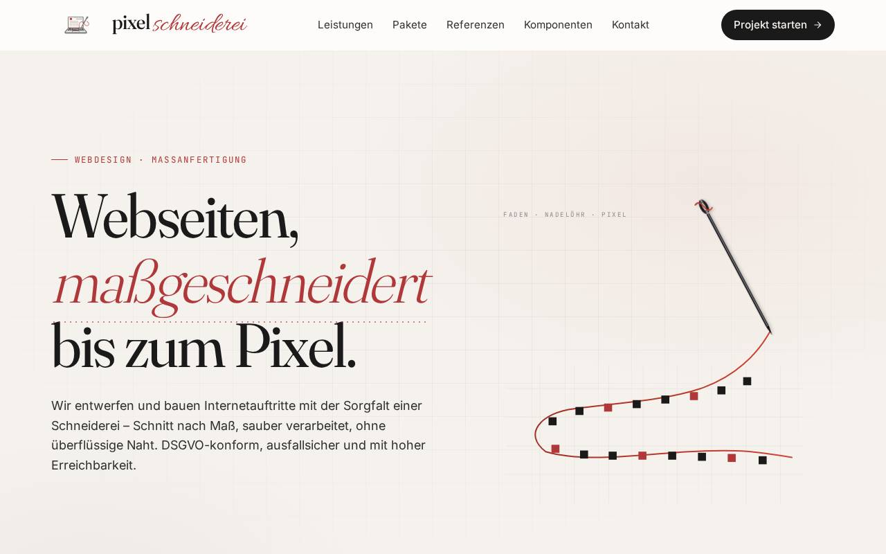

# pixelschneiderei.de

Source code of the website of **Pixelschneiderei**, a studio for tailor-made websites (German-language site).

**Live:** [pixelschneiderei.de](https://pixelschneiderei.de)



## Contents

Static website, no build step. Can be hosted on GitHub Pages, Cloudflare Pages, Netlify or any static host.

```
.
├── index.html              # Home page
├── referenzen.html         # Overview of all demos
├── komponenten.html        # Component showcase (forms, CTAs, WhatsApp, ...)
├── leistungen.html, agb.html, impressum.html, datenschutz.html
├── assets/                 # shared stylesheet and JS (nav, reveal animations)
└── demos/                  # sample sites per industry (atelier, holzgeist, aurora, atmen, arztpraxis, laden)
```

## Run locally

```bash
python3 -m http.server 8000
# or
npx serve .
```

## Tech stack

- Plain HTML, CSS and JavaScript, no framework
- Google Fonts (Fraunces, Inter, JetBrains Mono)
- No cookies, no trackers, no analytics

See [`AGENTS.md`](AGENTS.md) for contribution conventions.

## License

Content (c) Pixelschneiderei. Code is MIT-licensed, see [LICENSE](LICENSE).
